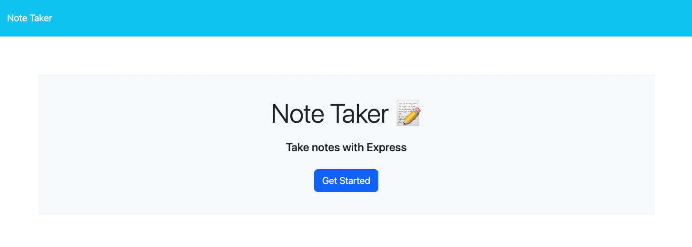
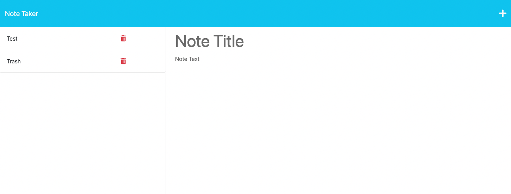
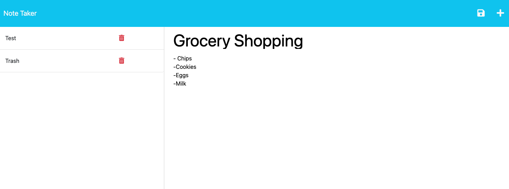

# note-taker

## Technology Used 

| Technology Used         | Resource URL           | 
| ------------- |:-------------:| 
| Git | [https://git-scm.com/](https://git-scm.com/)     | 
| Heroku | [https://dashboard.heroku.com/apps](https://dashboard.heroku.com/apps)   |
| Javascript | [https://developer.mozilla.org/en-US/docs/Web/JavaScript](https://developer.mozilla.org/en-US/docs/Web)   |
| Node.js | [https://nodejs.org/api/cli.html](https://nodejs.org/api/cli.html)   |
| NPM | [https://www.npmjs.com/](https://www.npmjs.com/)   |
| Express | [https://www.npmjs.com/package/express](https://www.npmjs.com/package/express)   |
| uniqid | [https://www.npmjs.com/package/uniqid](https://www.npmjs.com/package/uniqid)   |


## Description 


This program can allow users to create and save notes to help organize and keep track of tasks needed to be completed. Users can title a task and then write a description for it. They can then save it or delete it once it has been completed.


## Table of Contents 

* [Javascript Example](#javascript-example)
* [Usage](#usage)
* [Learning Points](#learning-points)
* [Author Info](#author-info)
* [Credits](#credits)


## Javascript Example

To get a hold of this project, simply navigate to my Github profile and select the repo "note-taker". From there copy the SSH link into your terminal, Gitbash, or whatever application you prefer and use git copy and then paste link. You can then open it using VS Code or access the working app from the deployed link.


```javascript
  app.post('/api/notes', (req, res) => {
      
      readNotes()
      .then(notes => {
          const parsedNotes = JSON.parse(notes)
          const newNote = {
              id: uniqid(),
              title: req.body.title,
              text: req.body.text
            }
            parsedNotes.push(newNote)
            writeNotes(parsedNotes)
            .then(() => {
                res.json(parsedNotes)
            })
        })
        .catch(err => {
            console.error(err)
        })
         
    })
```

In the above code, I used a post request to create new notes. the id of uniqid gives each note an unique ID while the title and text are taken from the request body. If this can't be done, it should log an error to the console.

```javascript
  app.delete('/api/notes/:id', (req, res) => {
        const { id } = req.params;
    
        readNotes()
        .then(notes => {
            const parsedNotes = JSON.parse(notes)
            const delNote = parsedNotes.findIndex(note => note.id == id);
    
            if (delNote !== -1) {
                parsedNotes.splice(delNote, 1);
                writeNotes(parsedNotes)
                .then(() => {
                    res.json(parsedNotes)
                })
                .catch(err => {
                    console.error(err)
                })
            } else {
                res.status(404).send('Note not found')
            }
        })
        .catch(err => {
            console.error(err)
        })
    });
```

In the above code, I created the ability to delete notes. I took a majority of the code from the app.post and with documentation I modified it to function correctly.


## Usage 

In order to use the note taker, you must first aquire it through GitHub, see above how to do this. After you open it in VS Code, you may then use your computer's terminal or the terminal in VS Code. Do begin taking notes, navigate to the deployed link. Once you have navigated to the home page click the get started button. There you may begin taking notes by entering in a title, then writing a description. After that click the save icon and your new note is saved! Then click the delete icon for whichever notes you feel are not needed anymore.


</br>




## Learning Points 


Through this project, I got more experience working in the back-end and got a better understanding of Express. I also learned how to use the app.delete syntax.


## Author Info


### Sam Higa 


* [Portfolio](https://samhiga.github.io/my-portfolio/)
* [LinkedIn](https://www.linkedin.com/in/sam-higa-b887b9209/)
* [Github](https://github.com/samhiga)

## Credits

I used the [app.delete](https://www.tabnine.com/code/javascript/functions/express/Express/delete) documentation to help create a working delete button.